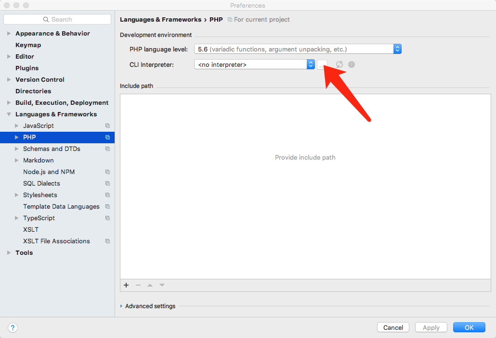
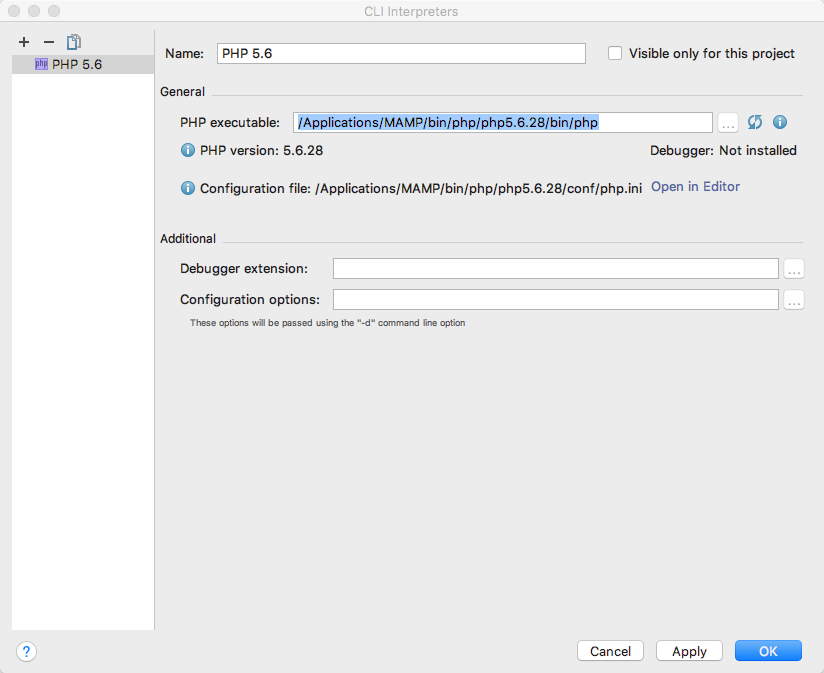
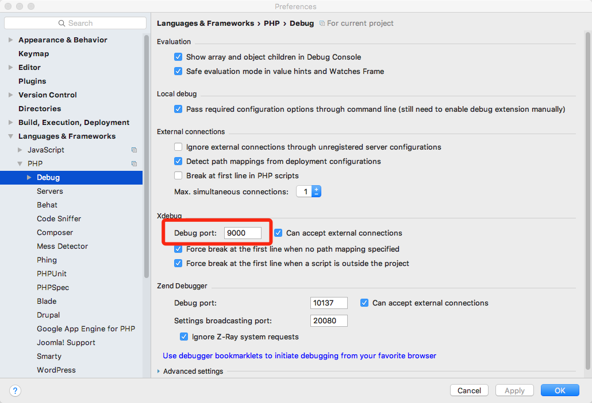
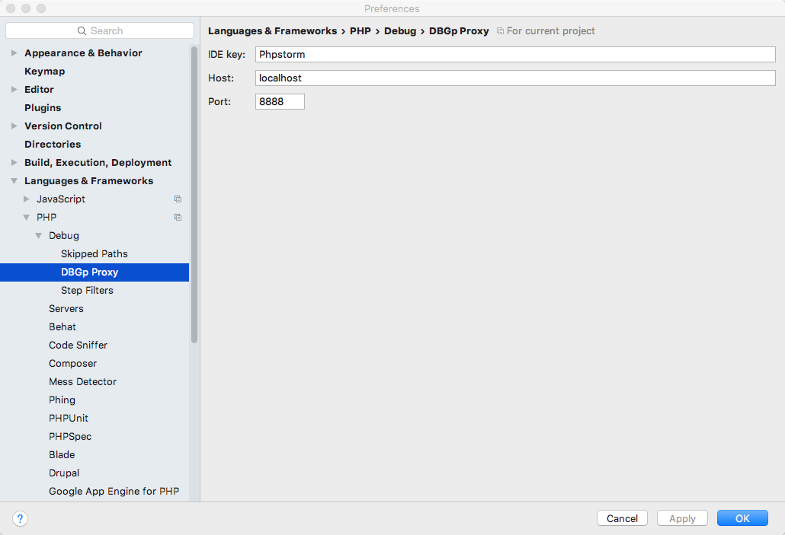
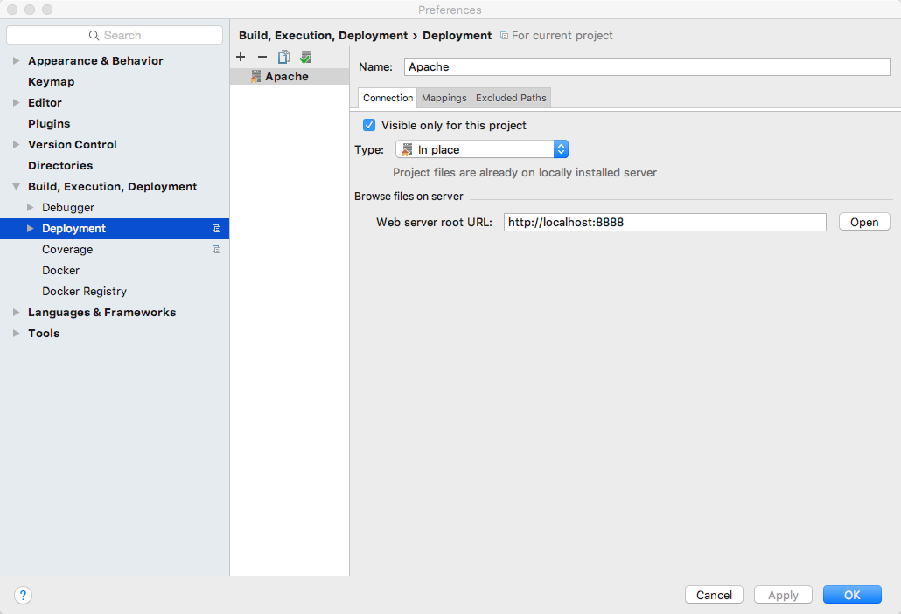
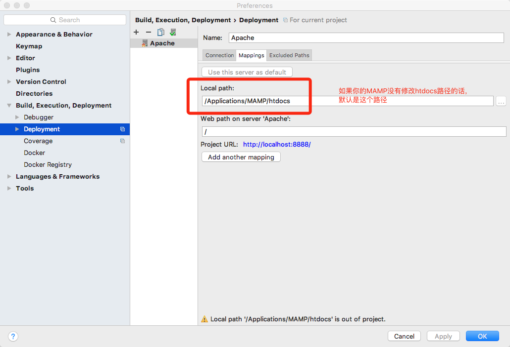

#### 一、下载
PhpStorm  是 jetBrains  公司的收费产品，但对于学生和教师有免费版，另外，在天朝，收费根本不是
事儿...

MAMP 是一个收费的、跨平台、多功能的软件站集合包，主要包含最新的  Apache 、 MySQL 、 PHP 、
PERL 发行版本，这样可以省去了很多关于选择 MySQL 和 PHP 的编译与配置选项的繁琐，使得大家可以专注于编程。

#### 二、安装
这里没什么好注意的，都是next就好了

#### 三、配置
###### 1. 配置MAMP
打开MAMP

到php选项下Default version选择php版本

到php选项下Extensions下将Xdebug选项打勾

###### 2. 配置php.ini

在php选项里面Default version右边有一个－>的图标，点击则打开对应版本的php.ini。在文件的底部
输入下面内容
```ini
[xdebug]
 zend_extension="/Applications/MAMP/bin/php/php5.6.28/lib/php/extensions/no-
 debug-non-zts-20131226/xdebug.so"
 xdebug.remote_enable=1
 xdebug.remote_host=localhost
 xdebug.remote_port=9000
 xdebug.remote_autostart=1
 xdebug.idekey="PhpStorm"
```
###### 3. 配置phpstorm
左上Phpstorm->Perferences

Languages & Frameworks -> PHP







保持这个debug post与刚才在php.ini里面的xdebug.remote_port=9000一致



##### 比较重要的一步来了，之前我Google到的配置教程一般都少了这个步骤

设置使用MAMP的Apache服务器,不然默认是打开PhpStorm自带的服务器




